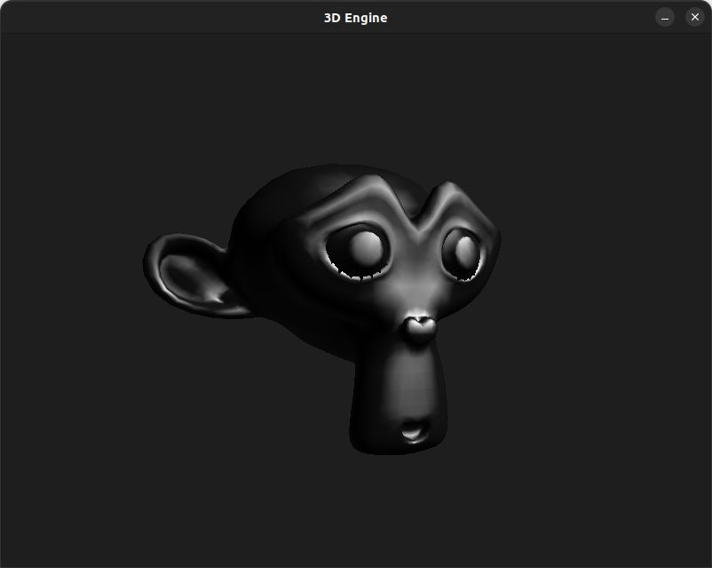
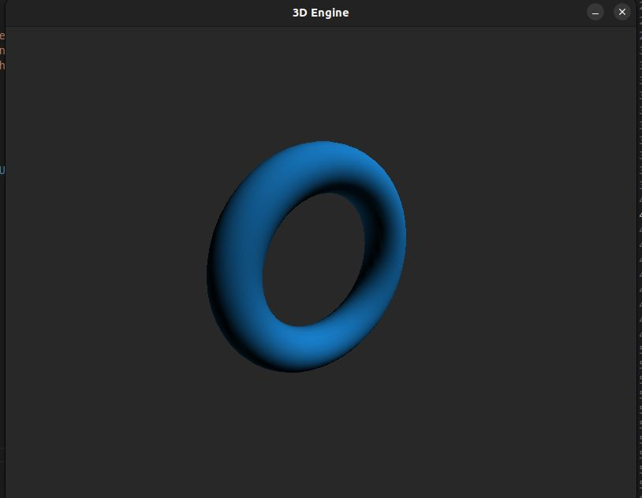
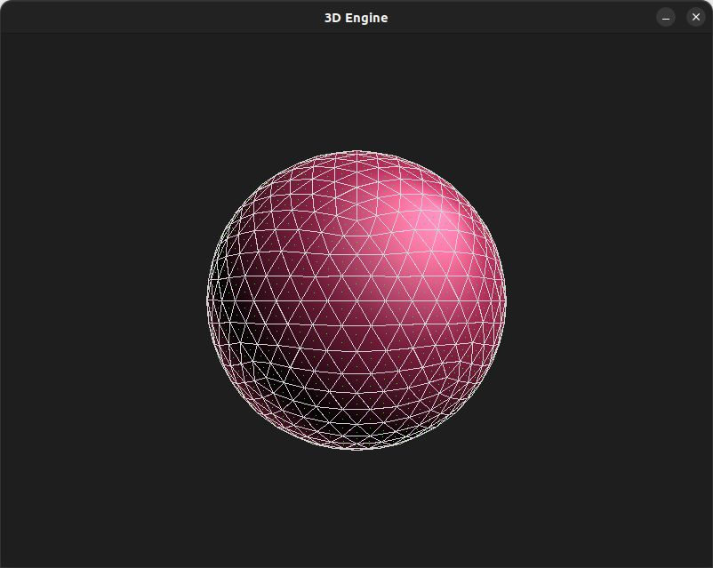

# 3DEngine

A simple 3D engine developed in C using the SDL2 library. The engine implements basic 3D rendering techniques, including wireframe and smooth rendering and object transformations.







## Features
- **Backface culling**
- **Z-sorting**
- **Smooth rendering**
- **Specular highlights**
- **Wireframe rendering**
- **Basic 3D transformations** (rotation, translation, scaling)

## Controls
- **Q/E**: Zoom in/out
- **WASD**: Rotate the model
- **Arrow keys**: Move the model

## Requirements
- SDL2

## Installation
1. Clone the repository:  
   ```bash
   git clone https://github.com/Eujota87/3DEngine
2. Compile the project using the provided Makefile:
   ```bash
   make && make run
